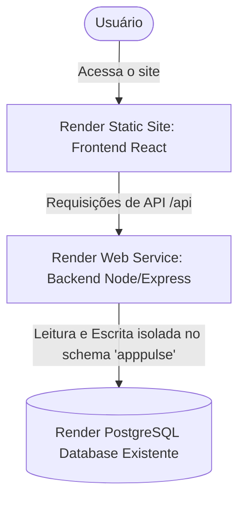

# Especificação de Deploy na Render - AppPulse Sentinel

Este documento descreve o plano de implantação (deploy) da aplicação **AppPulse Sentinel** na plataforma Render, utilizando a arquitetura separada com plano gratuito (Free Tier).

## 1. Arquitetura de Implantação

A aplicação será dividida em três componentes principais na Render:

1.  **Render PostgreSQL**: Banco de dados relacional existente do usuário. Usaremos o recurso de **Schemas** do PostgreSQL para criar um espaço de nomes isolado (`apppulse`), permitindo que a aplicação compartilhe a mesma base de dados sem colidir com outras tabelas.
2.  **Render Web Service (Backend)**: Aplicação Node.js/Express rodando a API e o engine de monitoramento periódico. Ele será instruído a rodar sob o schema `apppulse`.
3.  **Render Static Site (Frontend)**: Aplicação estática React/Vite distribuída via CDN.



---

## 2. Componentes e Configurações

### 2.1 Banco de Dados PostgreSQL (Render Existente)
*   **Nome:** Seu banco de dados existente.
*   **URLs Utilizadas:**
    *   **Internal Database URL:** Usada pelo Backend na Render para conexão.
    *   **External Database URL:** Usada temporariamente no script local para executar a migração inicial.

### 2.2 Backend (Render Web Service)
*   **Nome do Serviço:** `apppulse-backend`
*   **Ambiente:** Node
*   **Repositório:** Seu repositório conectado no GitHub
*   **Branch:** `main` (ou a branch de deploy desejada)
*   **Root Directory:** `backend`
*   **Build Command:** `npm install && npm run build`
*   **Start Command:** `npm start`
*   **Variáveis de Ambiente (Environment Variables):**
    | Variável | Descrição | Valor / Origem |
    | :--- | :--- | :--- |
    | `NODE_ENV` | Modo de execução | `production` |
    | `DATABASE_URL` | Conexão com o BD | *Internal Database URL* do seu PostgreSQL existente na Render |
    | `JWT_SECRET` | Chave de assinatura JWT | Uma string secreta e aleatória de segurança |
    | `PORT` | Porta interna da Render | `10000` |
    | `FRONTEND_URL` | URL de CORS permitida | URL gerada para o seu Static Site (Frontend) |

### 2.3 Frontend (Render Static Site)
*   **Nome do Serviço:** `apppulse-frontend`
*   **Repositório:** Seu repositório conectado no GitHub
*   **Branch:** `main`
*   **Root Directory:** `frontend`
*   **Build Command:** `npm run build`
*   **Publish Directory:** `dist`
*   **Variáveis de Ambiente (Environment Variables):**
    | Variável | Descrição | Valor / Origem |
    | :--- | :--- | :--- |
    | `VITE_API_URL` | Endpoint da API | URL do Backend na Render + `/api` (ex: `https://apppulse-backend.onrender.com/api`) |

---

## 3. Isolamento por Schema do PostgreSQL

Para que a aplicação compartilhe a base de dados existente com segurança, adicionamos as seguintes configurações:

1.  **Script de Migração (`backend/migrate.js`)**:
    *   Antes de rodar as tabelas, executa:
        ```sql
        CREATE SCHEMA IF NOT EXISTS apppulse;
        SET search_path TO apppulse;
        ```
2.  **Conexão do Backend (`backend/src/database/connection.ts`)**:
    *   Sempre que um novo cliente se conectar ao Pool do banco de dados, configuramos o schema ativo na conexão:
        ```typescript
        pool.on('connect', (client) => {
          client.query('SET search_path TO apppulse, public;');
        });
        ```

---

## 4. Plano de Ação Passo a Passo

1.  **Modificar a conexão do banco de dados** em `backend/src/database/connection.ts` para usar o schema `apppulse`.
2.  **Atualizar o script de migração** em `backend/migrate.js`.
3.  **Commitar e fazer push** das alterações para o GitHub.
4.  **Executar a migração local** contra o banco existente da Render usando o comando:
    ```bash
    MIGRATE_DATABASE_URL="sua_external_database_url_do_banco_existente" node backend/migrate.js
    ```
5.  **Criar o Web Service (Backend)** na Render conectado ao banco existente.
6.  **Criar o Static Site (Frontend)** na Render.
7.  **Atualizar o `FRONTEND_URL`** no Backend da Render.
8.  **Testar a aplicação** acessando a URL do frontend e fazendo login com o usuário padrão `admin@apppulse.com` / `123456`.
